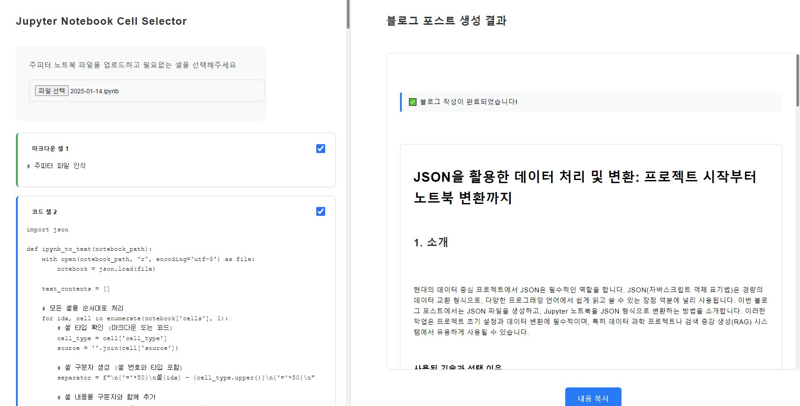

# Jupyter Notebook Blog Generator

주피터 노트북 파일을 분석하여 자동으로 기술 블로그 포스트를 생성하는 프로젝트입니다. LangGraph와 GPT-4o를 활용하여 노트북 셀을 분석하고, 관련 내용을 그룹화하여 구조화된 블로그 포스트를 생성합니다.

## 📱 예시 화면



## 🛠️ 기술 스택

### 백엔드
- **FastAPI**: 고성능 API 구축을 위한 웹 프레임워크
- **LangGraph**: 구조화된 처리와 워크플로우 관리
- **LangChain**: 대규모 언어 모델과의 통합
- **GPT-4o**: 콘텐츠 분석 및 생성을 위한 언어 모델

### 프론트엔드
- **Vanilla JavaScript**: 실시간 스트리밍 및 동적 UI 업데이트
- **Server-Sent Events (SSE)**: 실시간 콘텐츠 스트리밍
- **Custom CSS**: 반응형 디자인과 부드러운 전환 효과

## 🔄 LangGraph 워크플로우 구조

### 1. 그래프 구조
```
[START] → [그룹화] → [분석] → [블로그 생성] → [END]
```

### 2. 상태 정의
```python
class NotebookState(TypedDict):
    cells: Annotated[List[dict], "Notebook cells"]
    cell_groups: Annotated[List[Dict], "Grouped cells"]
    analyzed_groups: Annotated[List[Dict], "Analyzed cell groups"]
    blog_sections: Annotated[List[Dict], "Generated blog sections"]
```

### 3. 각 노드의 역할

#### 그룹화 노드 (group)
- 입력: 전체 노트북 셀
- 처리: 연관된 셀들을 의미 있는 단위로 그룹화
- 출력: 그룹화된 셀 정보 (`cell_groups`)
```python
{
    "cell_groups": [
        {
            "start_idx": 0,
            "end_idx": 2,
            "purpose": "초기 설정 및 환경 구성",
            "title": "환경 설정"
        }
    ]
}
```

#### 분석 노드 (analyze)
- 입력: 그룹화된 셀 정보
- 처리: 각 그룹의 목적과 구현 내용 분석
- 출력: 분석된 그룹 정보 (`analyzed_groups`)
```python
{
    "analyzed_groups": [
        {
            "title": "환경 설정",
            "purpose": "초기 설정 및 환경 구성",
            "analysis": "이 섹션에서는 필요한 라이브러리 임포트와 기본 설정을 수행합니다..."
        }
    ]
}
```

#### 블로그 생성 노드 (blog)
- 입력: 분석된 그룹 정보
- 처리: 섹션별 블로그 콘텐츠 생성
- 출력: 생성된 블로그 섹션 (`blog_sections`)
```python
{
    "blog_sections": [
        {
            "title": "환경 설정",
            "content": "이 프로젝트에서는 다음과 같은 라이브러리들을 사용합니다..."
        }
    ]
}
```

### 4. 데이터 흐름
```python
# 1. 셀 그룹화 (group_cells)
async def group_cells_with_stream(state: NotebookState):
    """유사한 목적을 가진 셀들을 그룹화"""
    await stream_callback({"status": "grouping"}, "status")
    return group_cells(state)

# 2. 그룹 분석 (analyze_groups)
async def analyze_groups_with_stream(state: NotebookState):
    """각 그룹의 목적과 기능 분석"""
    await stream_callback({"status": "analyzing"}, "status")
    return analyze_groups(state)

# 3. 블로그 생성 (generate_blog_post)
async def generate_blog_with_stream(state: NotebookState):
    """분석 결과를 바탕으로 블로그 포스트 생성"""
    await stream_callback({"status": "generating"}, "status")
    return generate_blog_post(state)
```

## 🚀 시작하기

### 필수 요구사항
```bash
pip install fastapi uvicorn python-multipart langchain openai python-dotenv
```

### 환경 설정
`.env` 파일 생성:
```
OPENAI_API_KEY=your_api_key_here
```

### 실행 방법
```bash
uvicorn main:app --reload
```

## 💡 기술적 설계 결정

1. **LangGraph 선택 이유**
   - 구조화된 워크플로우 관리 제공
   - 처리 단계 간 상태 추적 가능
   - 복잡한 처리 파이프라인 구현 용이

2. **스트리밍 구현**
   - SSE를 통한 실시간 업데이트
   - 장시간 실행 프로세스를 위한 연결 유지
   - 사용자에게 진행 상황 피드백 제공

3. **콘텐츠 처리**
   - GPT-4 토큰 제한 관리
   - 셀 간 관계의 문맥적 분석
   - 점진적 콘텐츠 생성

## 🔌 API 엔드포인트

```python
@app.post("/process-notebook/")
# 업로드된 노트북을 처리하고 JSON 형식으로 변환

@app.get("/generate-blog")
# 실시간 스트리밍으로 블로그 콘텐츠 생성
```

## 💰 소요 시간/비용

### 처리 시간
- 셀 그룹화: 약 10-15초
- 그룹 분석: 약 20-30초
- 블로그 생성: 약 30-40초
- 총 소요 시간: 평균 1-1.5분 (노트북 크기에 따라 변동)

### 토큰 비용 (예상)
- 셀 그룹화: ~2K 토큰
- 그룹 분석: ~4K 토큰
- 블로그 생성: ~6K 토큰
- 총 비용: 약 $0.10-0.15 / 요청 (GPT-4o 기준)

> 비용은 노트북의 크기와 복잡도에 따라 달라질 수 있습니다.
> 현재 GPT-4의 가격 정책 기준으로 책정되었으며, 변동될 수 있습니다.